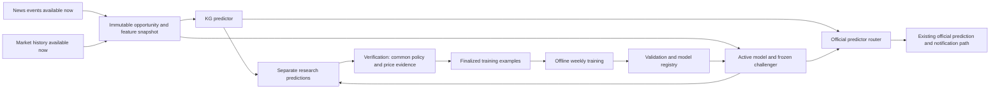

# E15: remaining development and completed-work checklist

Prepared: 2026-09-25. Status: approved; implementation in progress. Base inspected: `3005002`, with concurrent E14 sampled-price work in the working tree. Reconcile those changes at each implementation boundary.

This plan proposes parallel KG/model prediction inside Prediction, offline training, and weekly candidate training. Numeric thresholds below are **proposed initial operating policies**, not empirically optimal values or a promised accuracy. Freeze them before inspecting evaluation outcomes; changing a threshold starts a new experiment version.

## Delivery status — 2026-09-25

**Done** means implemented and tested locally, not deployed or proven to improve forecasting.
Completed functionality belongs in the [Prediction README](../../src/services/prediction/README.md)
and [SRS-04](../../requirements/SRS-04-prediction.md#712-research-evidence-capture).
The checked items below are completion records, not instructions to implement them again.
Unless explicitly marked Done, the design, schedules and acceptance criteria in sections 1–11 are
**remaining work**. A partially completed phase stays open until its remaining requirements pass.

### Done — evidence-capture delivery

- [x] **Done — PRD-64:** structured event versions and recorded receipt history.
- [x] **Done — PRD-65:** direct KG opportunities captured before abstention/publication filtering.
- [x] **Done — PRD-66:** invalid or unavailable event evidence identified explicitly.
- [x] **Done — PRD-67:** immutable, atomic opportunity/KG-result storage and replay handling.
- [x] **Done — PRD-68:** bounded capture failures, cancellation handling and capture health visibility.
- [x] **Done — PRD-69:** manual evidence export, integrity hashes and completion manifest.
- [x] **Done — documentation:** implemented architecture in the service README; behavior, storage,
  configuration and proving tests in SRS-04; research separation recorded in ADR-011.

Implementation details: [SRS-04 §7.12](../../requirements/SRS-04-prediction.md#712-research-evidence-capture).
Storage: [§9.6](../../requirements/SRS-04-prediction.md#96-research-evidence-tables).
Proving tests: [§11](../../requirements/SRS-04-prediction.md#11-verification).

### Remaining — E15 is not complete

- [ ] Freeze the pilot cohort, target policy and experimental baseline (P0).
- [ ] Pin context event revisions; add timestamped market features and finalized research labels (P1).
- [ ] Add trained inference, a frozen KG comparator and isolated research messaging (P2).
- [ ] Build training-ready datasets, models, calibration, registry and weekly training jobs (P3).
- [ ] Implement performance reports and run the controlled forward comparison (P4).
- [ ] Implement model promotion, controlled rollout, fallback and rollback (P5).
- [ ] Evaluate optional neural/hybrid extensions after the initial release (P6).

Evidence export is complete; a **labeled training dataset is not**. Production model activation and
an accuracy improvement have not been established. Keep E15 in the backlog while these items remain.

## 1. Objective and boundaries

Demonstrate whether a supervised model predicts future stock movement better than the current KG on comparable opportunities, horizons, and coverage. Initially the KG remains the official predictor. Models produce stored shadow predictions without notifications or graph-learning effects. If a candidate earns promotion, switch official routing atomically while retaining KG predictions for comparison.

The first implementation supports a fixed allowlist of liquid equities on one exchange with verified news and price coverage. Registry configuration records the exact assets and event families before training. Start with company-specific earnings/guidance and material corporate announcements where sufficient data exists; do not claim success on commodities or other exchanges from this pilot. A broader model is a separate evaluated cohort.

No generative LLM arbitration is added to Prediction. Initial local inference uses engineered news features and numerical market history. A frozen text encoder and a small neural model are later challengers. No automated trading is introduced. Better calibration, cleaner labels, and higher accuracy are distinct deliverables; improvement in one does not prove the others.

Current-code anchors: [decision function](../../src/services/prediction/prediction/decision.py), [pipeline](../../src/services/prediction/prediction/pipeline.py), [prediction storage](../../src/services/prediction/prediction/db.py), [intraday policy](../../src/services/verification/verification/intraday_policy.py), [learning updates](../../src/services/credibility/credibility/pipeline.py), and [message contracts](../../src/shared/shared/schemas/messages.py).

## 2. Runtime architecture and comparable opportunities

**Target architecture — not the current implementation.** The completed capture branch is shown in
the [service README](../../src/services/prediction/README.md#architecture). Extend it with the remaining
components below; do not recreate the completed capture/export functionality.

- **Partial — remaining:** extend the existing direct-context identity/capture to a policy-specific opportunity created before predictor evaluation, including model-specific abstention and KG firing-edge checks. Its identity must cover canonical asset, versioned event context, feature cutoff, horizon and policy; preserve existing capture history during migration.
- **Partial — remaining:** extend the captured event/firing-edge evidence with pinned event revisions, timestamped market observations, model feature values and a frozen experimental graph version. All predictors must receive the same cutoff and eligible raw evidence; a news+market-only model must not secretly consume KG output.
- **Partial — remaining:** extend the existing KG research result storage to market-only and model predictors with versioned identities, timeout status and probability semantics. Preserve the implemented distinction between result status and input quality; absence must never be interpreted as NEUTRAL.
- Reuse Prediction's package and service boundary, but execute CPU inference in a bounded worker process/pool. Do not block the async event consumer. Only the active model and one formal challenger run continuously; other candidates remain offline.
- Initially the official router selects KG. Research messages have a separate routing key and consumer queue, e.g. `prediction.research.recorded`; never publish shadow predictions as ordinary `prediction.made` messages that existing Notification or Credibility consumers could process.
- Proposed modes: `OFF` = existing behavior; `SHADOW` = KG official plus research candidates; `MODEL_PRIMARY` = the promoted model official for its approved cohort, KG retained as a comparator/fallback. Unapproved cohorts remain KG.
- First collect predictions on all opportunities to detect selection effects. The primary KG comparison uses the KG's eligible prediction opportunities selected without looking at outcomes; also report model-only coverage and all-opportunity performance. Shared notification caps are applied separately to compare the actual alert products.
- For the controlled model-vs-KG trial, freeze the research KG version. The production KG may keep its existing learning behavior, but log its point-in-time output separately. Changing the frozen comparator or challenger invalidates that formal trial. Do not edit live graph weights to freeze research.

## 3. Training and monitoring schedule

These automated jobs remain unimplemented for E15. Manual evidence export and capture health
counters are **Done** (PRD-68/PRD-69); they are not a daily training dataset job or model drift monitor.

| Activity | Proposed initial schedule | Rules |
|---|---|---|
| Live inference | Every eligible opportunity | New news changes inputs, never trained parameters |
| Outcome reconciliation | Every 15 minutes for due evaluations | Bounded jobs; labels remain pending until their deadline and required evidence are complete |
| Dataset manifest and quality report | Daily at 01:00 UTC | Immutable incremental export; store cutoff, counts, exclusions, and provenance |
| Candidate training | Sunday at 06:00 UTC | One exclusive training run; use only finalized labels known at the cutoff |
| Formal promotion trial | At most one active trial | Challenger and comparators stay frozen while outcomes accumulate |
| Health/drift checks | Health continuously; feature quality hourly; finalized performance daily | Warnings do not automatically retrain or promote |
| Schedule review | After three months of operation | Consider monthly training if fresh-data volume is low and measured results remain stable; no automatic cadence change |

Use UTC scheduling so DST cannot duplicate or skip a training run. The scheduler belongs to the deployed offline training worker, not a developer's desktop. This plan does not create a Codex reminder or automation.

Weekly retraining runs only after **at least 100 new finalized event/asset/horizon examples across at least five trading dates and 20 distinct event clusters** have arrived since the previous successful training snapshot. Syndicated articles and repeated predictions do not count as new examples. These are minimum anti-churn floors, not evidence of statistical sufficiency. Skip with `INSUFFICIENT_NEW_DATA` otherwise; cumulative new data remains eligible next week.

Also skip on incompatible schema, poor source coverage, unresolved label revisions, missing required classes, or an active training lease. Failed runs do not change the current model or the last-successful dataset pointer. Permit one bounded retry for transient infrastructure failure using the same frozen snapshot; deterministic data/model failures require diagnosis. Resume at most one missed weekly run after downtime, not one job for every missed week.

Start with batch retraining of the prediction estimator from a fresh initialization, using old plus new examples in a rolling window. Do not modify the live estimator one article at a time. A frozen text encoder, if used, stays frozen and cached; retraining the prediction head does not imply training a language model again. Continuous learning is deferred until batch results establish a baseline.

## 4. Constructing training data from news and prices

### 4.1 The unit of data

Raw event/capture provenance is **Done** as documented in SRS-04. The table below specifies the
remaining complete training-example contract; populated capture fields should be reused.

One example represents an asset and a distinct event context at a recorded prediction opportunity, evaluated under one policy. It is not one example per news outlet. For overlapping contexts, retain the raw audit records, group by underlying event, and normalize weights so repeated versions and industry fan-out cannot dominate training.

| Data group | Required fields |
|---|---|
| Identity | Example/opportunity ID, canonical asset, exchange, currency, context/event IDs and versions, policy/horizon version |
| News evidence | Article ID, source, content hash, permitted text or stable features, publication time, first receipt, revision time, extraction/encoder version, entity relevance, event cluster |
| Time cutoffs | Feature cutoff, inference completion, durable research receipt, official publication/receipt evidence where applicable |
| Market features | Referenced observation IDs, market timestamps, receipt timestamps, provider and listing identity, adjustment conventions, trailing price/volume/volatility features and missingness flags |
| Graph evidence | Graph snapshot/hash, firing edge states and directions at cutoff, optional graph features; no later graph state |
| Labels | Eligible start/end observation IDs and timestamps, realized return, class, quality status, finalized/known-at timestamps, revision, policy hash |
| Lineage | Code/dependency versions, universe/mapping/calendar versions, dataset manifest/hash and exclusion reasons |

News/price availability must satisfy **both event time and system receipt time at or before the feature cutoff**. A headline published at 10:00 but first obtained at 10:40 cannot appear in a 10:05 training input. Revised text creates a new version and never overwrites what was available earlier.

Historical archives without trustworthy acquisition/revision timestamps may bootstrap a clearly marked research dataset using declared latency assumptions. They cannot establish live-replay accuracy. Formal forward evaluation uses actual captured availability times. Audit encoder pretraining dates and later-knowledge contamination; record any limitation rather than assuming an old headline makes a modern model point-in-time.

### 4.2 Features available at prediction time

- News: company/entity relevance, event family, polarity, uncertainty, novelty relative to earlier stories, source provenance, article/event age, and independent coverage count. Include numeric earnings/guidance surprise only when actual and pre-release consensus values are timestamped and available.
- Market: trailing returns over declared windows, realized volatility, volume/turnover, prior-close gap, market/sector returns known so far, liquidity/spread when observed, session phase and time remaining. Baseline feature availability determines the supported cohort; do not fabricate volume from price snapshots.
- Optional text: TF-IDF as a simple baseline; frozen language-appropriate financial embeddings as a challenger. Financial sentiment is an input, not a return probability. Preserve language and translation/encoder version. Unsupported language yields explicit abstention or a separately validated fallback.
- Optional graph: factor/exposure identifiers, signed strengths, disagreement and neighbor aggregates from the recorded snapshot. The independent model excludes all graph features; the hybrid is a separately named experiment.
- Fit normalization, imputation, vocabulary, dimensionality reduction, and feature selection on training data only. Publish the exact same transformation artifact with the model for live inference.

Do not train directly on raw price levels as the principal cross-company signal. Prefer returns and appropriately scaled quantities. Do not use next-day high/low, later consensus, revised news, settled scores, or learned future KG weights as input features.

### 4.3 Labels and prediction timing

Proposed first direction policy: `POST_AVAILABILITY_TO_CLOSE_V1`, distinct from the legacy previous-close-to-close policy. This is a research contract initially; it does not silently redefine current `ONE_TRADING_DAY` messages.

1. Let both predictor results become durably available to the research evaluator. Define the paired availability boundary as the later receipt time; outputs must finish within the inference deadline. Freeze both predictions before the starting market observation is known. A late or absent challenger result is a failure, not permission to choose a later convenient baseline: use the predeclared deadline as the shared boundary for that opportunity, retain its price label when available, and count the failed method under the rules below.
2. Resolve the asset's actual exchange session. During regular trading, use the first eligible observation after the paired boundary. Outside regular hours, use the next regular session's eligible opening observation. Require at least 30 minutes remaining before close; otherwise mark the opportunity ineligible for this policy rather than silently changing horizons.
3. With validated minute bars, use the open of the next full minute strictly after the boundary, with maximum baseline delay 120 seconds. Exclude partial bars and pre-boundary extremes. Require a validated final regular-session close on a consistent instrument/price basis. Endpoints suffice for closing return; full path coverage is additionally required for no-hit or first-touch claims.
4. Compute `r = end_price / start_price - 1`. Initial direction threshold is a frozen 0.003 (0.3%) for the pilot: UP if `r > 0.003`, DOWN if `r < -0.003`, otherwise NEUTRAL. Test exact boundary semantics. This provisional threshold is a policy choice, not a universal noise or profitability threshold.
5. Store the continuous return alongside the class. The initial primary target is closing direction. Expected return and magnitude can be separate trained regression heads, validated independently. Market-relative returns are a separate optional label and must not be confused with absolute UP/DOWN.
6. A label becomes training-eligible only after the deadline, validated required observations, and a 24-hour finalization buffer. A later provider correction creates a new label revision and dataset manifest; invalidate affected evaluation reports, never rewrite their history invisibly.

**E14 integration:** 15-minute Avanza snapshots use a separate policy such as `SAMPLED_POST_AVAILABILITY_V1`, with its own allowed baseline delay (initially 20 minutes), endpoint freshness and cohort. Preserve actual quote and observation timestamps; a page read now can display a stale quote. If a verified closing observation is unavailable, the target is explicitly last-observed return, not official closing return. Sampled target hit means observed at a sample; absence of an observed hit is not proof that no hit occurred between samples. Never mix sampled, minute-bar, and legacy labels in one training target or comparison metric. Sparse sampled observations cannot train a continuous first-touch label. Daily-only history can support a separate verified pre-open-to-close experiment, not an intraday backfill.

Example: news is received 10:02:15, the common cutoff is 10:02:20, and both research outputs are durably received by 10:02:22. For minute-bar policy, the baseline starts at 10:03. With start price 100 and regular close 101, the +1% label is UP. Prices or text received after 10:02:20 are excluded from features even if their publisher timestamp is earlier. Label prices are only joined after the outcome is final.

### 4.4 Quality, missingness and history

Verification owns labels. Use explicit `PENDING`, `FINAL_VALID`, `UNSCORABLE`, `REVISED`, and `WITHDRAWN_BEFORE_AVAILABILITY` states. Missing prices, identity uncertainty, clock errors, and incompatible corporate actions are not prediction losses and are not NEUTRAL. Report their counts and rates alongside accuracy; data exclusions must be model-independent.

**Done:** direct KG opportunity capture includes abstentions and suppressed stances (PRD-65).
**Remaining:** turn those evidence records into labeled training examples using versioned exports
from the owning services. Do not depend solely on `verification.scores`: that table represents a
selected output stream and legacy labels. Offline analytics may use an explicitly documented
read-only consistent database snapshot; no trainer writes another service's schema.

Plan for up to 36 months of eligible history; initial formal development needs at least 18 chronological months for the split design below. Minimum dataset floors: 1,000 distinct event/asset/horizon examples, 200 underlying event clusters, and at least 100 examples of each class in fitting data. Each evaluation block needs at least 30 outcomes of each class. If unavailable, collect/backfill permitted history and keep KG live; do not relax thresholds after seeing results. Floors are not a sample-size guarantee; inspect learning curves and uncertainty.

Archive eligible training inputs before operational retention deletes them. Coordinate with [E11](../E11-Data-Retention/README.md), respect source-specific retention permissions, and keep reproducible lawful features/manifests. Avoid current-listing survivorship bias: use point-in-time universe membership or explicitly limit the claim to the chosen current universe. Preserve renamed/delisted identities and do not silently drop their bad outcomes.

## 5. Offline model training and validation

Initial comparison families, with a maximum of 20 predeclared configurations per weekly run:

| Candidate | Purpose |
|---|---|
| Class-prior and simple momentum baselines | Detect apparent improvement that simple rules already explain |
| Recorded/frozen KG | Existing system reference, including abstentions |
| Market-only regularized classifier | Test whether news adds information |
| News-only regularized classifier | Measure standalone news information |
| News + market logistic regression | Low-complexity combined baseline |
| News + market gradient boosting | First nonlinear candidate |
| Combined model + graph features | Test the graph's incremental value |

Later test a frozen financial text encoder plus a small market/text fusion network. Fine-tuning an encoder requires enough independent examples, a bounded compute budget, and a new experiment. Do not assume an LSTM, transformer, or graph neural network is superior before measuring it.

Chronological split example with 18 months: train months 1–12, tune months 13–14, calibrate month 15, test month 16; advance one month for the next fold, then again. Earlier fold results support development; keep the last test month untouched until one candidate and thresholds are frozen. With more history, use a rolling fitting window up to 24 months rather than unlimited ancient data. A weekly run's final prospective trial is the definitive new evidence; a repeatedly inspected historical test is development data, not an untouched holdout.

Split all assets on common time boundaries. Remove training examples whose outcome intervals overlap validation/test boundaries, and add an embargo of at least one full eligible session for this horizon. Event/revision groups that straddle a boundary must be purged from the earlier partition. Use timestamp interval checks, not a fixed number of rows across irregular assets. Ordinary random K-fold or a row-count gap alone is insufficient.

Train the estimator on the fitting partition; tune its parameters and decision/abstention rules on validation; fit its probability calibrator on the separate later calibration partition. Freeze the entire estimator+transform+calibrator+threshold bundle before test. Do not refit on calibration or test data afterward and deploy a different untested bundle. Class weights, if needed, come from fitting data; report original class frequencies and correct/calibrate probabilities on the untouched distribution.

Outputs: probabilities for all three classes summing to one; predicted class; separate `abstain` action/reason; optional expected return/range if its head passed validation. A neutral forecast means small realized movement, whereas abstention means insufficient evidence. Never map inference failure to a successful neutral forecast.

Every run records dataset hashes, sample/group/date counts, exclusions, splits, seeds, model/library/encoder/code versions, hyperparameters, all trials, resource use, metrics, artifact hashes, and the rejection/promotion decision. Re-running a manifest with the same configuration must reproduce predictions within documented numerical tolerance. Initial resource budget: at most four hours and one training process on the dedicated worker; record actual memory/CPU measurements before setting deployment limits. Budget exhaustion marks the run incomplete and leaves the current model unchanged.

## 6. How performance is checked and a model earns replacement

Training, choosing a research challenger, and replacing the official model are separate decisions.

### 6.1 Metrics and fair denominators

- Primary metric: three-class balanced accuracy on finalized common eligible KG opportunities, with all NEUTRAL outcomes included. Raw accuracy, macro-F1, confusion matrices and per-class precision/recall are mandatory companion metrics.
- Keep every scorable eligible opportunity in the primary denominator. Missing features, failures, timeouts and abstentions by a compared method count as incorrect for that method's per-class recall; they cannot remove the opportunity from comparison. Only model-independent evidence failures can make the outcome unscorable. Also report the deployed model-plus-fallback route separately, so KG fallback wins are not attributed to the model.
- Report forced-class predictions for every successful model inference separately from selective notifications. Show accuracy/precision versus coverage, at comparable coverage and under the same notification cap. Do not inflate accuracy by dropping losing predictions or selecting only outcomes that later moved.
- Use multiclass log loss, Brier score, and classwise reliability diagrams for probabilities. Do not reinterpret KG rule strength as probability; probability comparisons against KG require a separately fitted, frozen KG calibrator or are marked unavailable.
- Compute paired differences using identical opportunities and labels. Resample chronological day blocks while keeping related event groups and asset fan-out together; report an event-cluster sensitivity analysis. Plain independent-row error bars are inadequate.
- Slice by asset, event family, direction, language, volatility regime, latency, source, direct/propagated path, and evidence policy. Sparse slices say insufficient evidence; do not rank assets from a handful of examples.
- If trading usefulness is claimed later, evaluate executable entry/exit assumptions, spread, fees, slippage, turnover and drawdown separately. Higher direction or target-hit accuracy alone does not establish profit.

### 6.2 Candidate gates

Initial proposed thresholds are deliberately explicit so implementation cannot choose them after seeing the winner:

| Gate | Required result |
|---|---|
| Data validity | No known point-in-time leakage, wrong-asset/price identity or policy mixing; all manifests and features reproducible |
| Coverage | Required-feature availability at least 95% of the declared eligible cohort; inference success at least 99%; report excluded/unscorable outcomes separately |
| Historical comparison | At least +2 percentage points primary balanced accuracy over both KG and market-only baseline on the held-out comparison; positive average across chronological folds |
| Replacement of an existing ML model | Also improve primary metric over the current ML champion by at least +2 percentage points; otherwise keep it |
| Probability quality | Brier/log loss no worse than the fitted class-prior baseline and, when present, current ML champion on the same cohort; reliability plots must accompany the decision |
| Directional coverage | At the predeclared operating threshold, alert coverage at least 90% of the comparator's eligible coverage; also show matched-coverage performance |
| Protected pilot slices | No supported class or adequately sampled pilot asset/event slice loses more than 5 percentage points of recall/accuracy; if sparse, restrict the deployment cohort rather than claiming broad coverage |
| Operational budget | Cached-feature inference p95 at most 250 ms, hard deadline 1 second; no more than 10% regression in KG processing latency during shadow operation |

All effects and gates must be recomputed on a **forward shadow trial**, not just the historical test. Choose one challenger before the trial starts, freeze its artifacts and the comparison protocol, and let newer weekly candidates wait. The first trial lasts 30 exchange sessions. If predeclared outcome-count floors are not met, extend once to 60 sessions based only on counts, without checking comparative success. Require at least 500 paired finalized examples, 100 event clusters, and 30 outcomes per class. If still insufficient, classify the trial as inconclusive. These floors do not replace power/uncertainty checks; a small real improvement may need substantially more evidence.

Use at most 12 formal promotion decisions in an annual evaluation campaign. Reserve a family-wise false-positive budget of 5%; each decision uses `0.05 / 12`, with multiplicity correction across required comparator tests. Report ordinary 95% intervals for interpretation and the stricter decision evidence separately. At the prespecified endpoint, require a positive adjusted lower confidence bound on the paired primary-metric gain. Use a validated block-resampling inference method with enough resamples for the required tail resolution; an unresolved/unstable interval is inconclusive. Do not repeatedly peek and promote on the first favorable day or reset the campaign to erase failed attempts.

The final decision is `REJECTED`, `INCONCLUSIVE`, or `ELIGIBLE_FOR_PROMOTION`, with reasons. Passing checks supports a bounded operational decision, not certainty about future accuracy. A result improving only an event subset may support a new, prospectively confirmed cohort-specific candidate; it cannot justify choosing that subset from the same test and calling it validated.

### 6.3 Replacement sequence

Model registry lifecycle: `TRAINED -> OFFLINE_PASSED -> SHADOW -> ELIGIBLE -> CANARY -> ACTIVE -> RETIRED`; failures branch to `REJECTED`, `QUARANTINED`, or `ROLLED_BACK`. Each transition is durable and auditable. Initial `promotion_mode=REPORT_ONLY` emits the eligibility report; enabling automatic activation later is an explicit deployment configuration decision, not an effect of the training schedule.

When activation is enabled and a candidate passes:

1. Load the exact evaluated bundle into a standby inference worker. Verify hash/signature, feature schema, policy, supported universe, dependencies, and probability/latency smoke checks. Accept only trusted registry artifacts; never load arbitrary untrusted serialized models.
2. Begin a deterministic canary on 10% of eligible opportunity IDs for at least five trading sessions. Keep both systems' research outputs. The canary is an operational check, not an independent proof of accuracy. Route each official alert through only one predictor and retain its predictor/version provenance.
3. On operational success, atomically compare-and-swap the active version pointer. Every in-flight opportunity retains the model version pinned at its start; new opportunities use the new version. Prevent two trainers/deployers from racing to promote different candidates.
4. Persist an activation event/outbox record. Keep the prior model immediately loadable and KG available. Retain at least the latest three promoted bundles and their manifests; do not delete artifacts referenced by retained prediction records.
5. If load, compatibility, or inference fails, keep/revert the active pointer to the previous healthy version. If no healthy model applies, use eligible KG output with an explicit fallback reason; if data is invalid for both, abstain. Do not retry after observing the outcome or emit duplicate alerts.

Weekly runs continue to create candidates. They do not update the active model's parameters and cannot overwrite its artifact path. An eligible result is invalidated if any component of the bundle or target policy changes after evaluation.

### 6.4 Monitoring and rollback

Immediate circuit-breaker conditions: model artifact/checksum mismatch, incompatible feature schema, nonfinite probabilities, probabilities not summing to one within tolerance, or invalid instrument/price identity. Disable ML for the affected cohort and use the defined fallback.

Operational thresholds: more than 1% inference failures/timeouts over the last 100 opportunities, or p95 exceeding 250 ms for three consecutive measured windows, pauses the canary/ML route. Low-volume cohorts accumulate enough requests rather than creating meaningless percentages.

Monitor feature missingness and drift hourly against training reference distributions, with a five-percentage-point rise in required-feature missingness as a starting alert threshold. Drift alone does not prove lower accuracy; it triggers investigation and pauses promotion.

Review finalized results daily. At predeclared 20-session review boundaries with at least 200 valid pairs, a model trailing its continuously logged healthy fallback by at least 5 percentage points in balanced accuracy across two consecutive reviews triggers an operational rollback review. Severe known data or logic corruption triggers immediate rollback. Log performance-based rollback as risk control, not a new statistical discovery. Insufficient labels mean unknown performance, never automatic success.

## 7. Storage, contracts and ownership

**Done:** the three capture tables and their actual keys are documented in
[SRS-04 §9.6](../../requirements/SRS-04-prediction.md#96-research-evidence-tables).
Snapshots are currently stored on the opportunity; do not recreate them as a separate table merely
because the initial design used the name `feature_snapshots`.

Remaining additions and extensions stay in service-owned schemas:

| Owner | Proposed records |
|---|---|
| Prediction | Extend existing opportunities/snapshots/results for model features and predictor/policy versions; add `training_runs`, training `dataset_manifests`, `model_versions`, `model_activations` and candidate-trial registry |
| Verification | `research_evaluations`, versioned `research_labels`, evidence links, paired-policy registration and comparison reports |
| Ingestion/Cleansing | Existing evidence plus missing receipt/revision/entity/feature provenance; versioned exports before retention |
| Market Data | Existing daily/minute/E14 observations and validated evidence readers; no synthesized missing history |
| Credibility | Existing official KG learning only during shadow; later policy/version-isolated learning changes if separately selected |

Uniqueness includes `(opportunity_id, predictor_id, model_version, policy_version)` for research predictions and `(research_prediction_id, policy_version, label_revision)` for outcomes. Use foreign keys/business identities that support multiple methods on one opportunity; the current official prediction idempotency key must not cause the challenger to overwrite or suppress KG.

Verification remains the owner of price requests and scoring. Define new typed research messages and explicit queues/DLQs with outbox/idempotent handlers; reuse underlying market observations, not duplicate expensive provider requests per model. Shadow results must never update live graph weights or source credibility, including after duplicate/replayed messages. Preserve published historical predictions even after a later stance contradicts them.

New probability vectors, abstention, return estimates, and policy/version semantics require deliberate model/API changes. Existing `GRAPH_ONLY`, magnitude, and `confidence` fields cannot silently change meaning. On official ML promotion, extend/version the official contract with `predictor_id`, `model_version`, target policy and valid probability semantics, update all consumers, and report KG strength separately. ML output must not be fed into KG edge learning without a separately designed attribution contract. Notification displays predictor, horizon and uncertainty without claiming guaranteed outcomes.

Before each implementation phase, reread the owning SRS: [Shared](../../requirements/SRS-01-shared-foundation.md), [Ingestion](../../requirements/SRS-02-ingestion.md), [Cleansing](../../requirements/SRS-03-cleansing.md), [Prediction](../../requirements/SRS-04-prediction.md), [Market Data](../../requirements/SRS-05-market-data.md), [Verification](../../requirements/SRS-06-verification.md), [Credibility](../../requirements/SRS-07-credibility.md), and [Notification](../../requirements/SRS-10-notification.md). After implementing and verifying the behavior, update those specifications in the same delivery change. **Done:** capture separation is recorded in ADR-011. **Remaining:** record the later messaging/promotion decisions when implemented. Current graph-only official routing remains authoritative until the corresponding implementation and contract changes are delivered.

## 8. Edge cases and required acceptance tests

These are remaining end-to-end acceptance checks. Completed capture-level tests are linked in
SRS-04 §11; partial rows below identify the additional proof still needed.

| Case | Required behavior and proof |
|---|---|
| Syndication, repeated articles and near duplicates | One underlying event group; duplicate delivery yields one example/result, not extra evidence |
| Different stories sharing keywords | Preserve distinct event identities; extraction quality fixture includes misleading background mentions |
| Old news received late or revised after the cutoff | Partial: capture availability/revision rejection tests are Done; add pinned-revision training replay and market-feature cutoff checks |
| Rumor, denial, negation, conflicting reports | Preserve uncertainty/polarity/conflicts; abstain when evidence is unresolved |
| Multi-company story or industry fan-out | Entity-specific relevance; weight/group related samples; distinguish acquirer from acquisition target |
| Earnings increase but miss expectations | Feature distinguishes actual growth from surprise when timestamped consensus exists |
| Unsupported language or encoder update | Explicit fallback/abstention; encoder change creates new feature/model versions |
| New asset, rename, ADR, share class or delisting | Canonical point-in-time identity; no unsupported substitution or deletion of bad outcomes |
| Wrong currency, pence/pounds scale or provider listing | Reject incompatible evidence before feature/label creation |
| Split, dividend, merger or futures roll | Corporate-action-consistent series or UNSCORABLE; commodities/futures excluded from equity pilot |
| Holiday, early close, DST or overnight news | Exchange-calendar fixture resolves the correct session and minimum remaining window |
| Halt, stale quote or zero liquidity | Freshness/status checks; do not turn an unchanged stale quote into NEUTRAL evidence |
| Broker delay or model timeout | Baseline follows paired durable availability; preserve timeout/failure and fallback counts |
| Partial minute at decision time | No pre-start high/low or opening price is eligible |
| Missing bars or delayed close | Pending until bounded finalization; then UNSCORABLE with reason, never guessed prices |
| 15-minute sample misses an intervening spike | Sampled policy reports target not observed; cannot assert no intraday hit |
| Both target and adverse barrier inside one bar | Ordering is unknown without finer data; do not manufacture first-touch success |
| Target hit then reversal | Target-hit and closing-direction outcomes remain separate |
| Predicted NEUTRAL versus abstention | Partial: KG capture distinction is Done; extend it to trained outputs, finalized labels and comparison metrics |
| Supersession after public availability | Retain original prediction/evidence; no selective removal of losing forecasts |
| Multiple predictions per asset/session | Shared caps and separate uncapped research opportunities; avoid reusing one outcome as independent samples |
| Missing or very rare label class | Fail training/calibration or narrow cohort prospectively; do not force misleading class probabilities |
| Random split or overlapping labels | Leakage test rejects it; event groups and outcome intervals are purged at time boundaries |
| Graph trained using later outcomes | Historical replay requires archived state or omits graph features; never query today's graph for old examples |
| Label correction after candidate approval | New revision invalidates affected reports and eligibility; retain the original audit trail |
| Duplicate score, reordered messages, partial DB failure | Exactly one effective label/activation; transaction/outbox recovery fixtures prove restart behavior |
| Training crash, scheduler downtime or concurrent trainers | Fenced lease, immutable manifest, bounded retry; active model unaffected |
| New model slower or missing feature | Deadline/fallback and coverage recorded; no biased omission from evaluation |
| Corrupt/untrusted artifact, dependency mismatch | Reject before load; trusted registry and checksum compatibility checks |
| Activation mid-request or worker restart | Per-opportunity version pin; atomic active pointer; no mixed transformations |
| Drift or strong performance only in one historical regime | Restrict claims; forward trial and slice checks; no automatic architecture change |
| Repeated candidate testing and test-set tuning | Trial registry, frozen thresholds, prespecified endpoint and multiplicity budget |
| Snapshot-only history lacks volume or quote timestamps | Omit unsupported features/use declared cohort; never infer nonexistent observations |
| Shadow queue accidentally bound to Notification/Credibility | Contract/integration tests assert zero alerts and zero live graph changes |
| Existing pending stance from an earlier session | Partial: capture before stance filtering is Done; implement expiry/horizon for official routing |

## 9. Implementation phases and release gates

| Phase | Status | Remaining work | Exit condition |
|---|---|---|---|
| P0: Freeze the experiment | Open | Freeze cohort/target policy, deployed versions, provider capabilities, thresholds and baseline defects | Experiment manifest and timing/price fixtures; no unresolved source-of-truth mismatch |
| P1: Evidence and labels | Partial — capture Done | Pin event revisions; add point-in-time market joins, shared evaluator timing, finalized policy-isolated labels and dataset quality reporting | Complete training examples and timing/price/correction acceptance tests |
| P2: Parallel prediction | Open — reuse KG capture | Predictor interface, frozen KG comparator, bounded ML worker, research contracts/outbox and routing modes | Same opportunities reach both paths; no duplicate alerts or shadow learning |
| P3: Offline training | Open — manual evidence export Done | Labeled dataset construction/manifests, split/purge logic, models, calibration, registry, weekly scheduler and skip rules | Reproducible training/rejection report; resource limits enforced; no live mutation |
| P4: Forward comparison | Open | Frozen challenger, fresh paired labels, metrics, coverage, resampling and trial budget | Traceable eligible/rejected/inconclusive decision |
| P5: Controlled replacement | Open | Standby load, canary, atomic routing, versioned official contracts, fallback/rollback and monitoring | Gates met and rollback drill passed; activation controlled separately |
| P6: Neural/hybrid expansion | Deferred until initial release | Frozen text fusion, optional fine-tuning/graph features and extra cohorts | Each candidate passes the same historical/forward protocol |

Do not estimate a guaranteed completion date from coding effort: collecting enough independent market outcomes can take longer than implementation. Existing fixes to edge-credit attribution, policy timing, calibration semantics, and stance expiry should be tracked explicitly in P0/P1; freeze a baseline version so simultaneous repairs are not misattributed to ML.

Definition of done for the initial release: KG and ML run on identical recorded opportunities; training uses only eligible past information; weekly jobs create versioned candidates without touching the active model; a complete paired report explains promotion/rejection; every active output identifies its predictor and policy; rollback is tested; shadow processing has no notification or graph-learning side effects; and the documentation release gate below is complete. If no candidate beats KG, retaining KG is a successful, evidence-based experimental outcome.

### 9.1 Documentation release gate after development

**Done for the capture delivery:** Prediction README and implemented Mermaid architecture, SRS-04
behavior/configuration/storage/test coverage, source README link, and ADR-011. Their functional
details are maintained in those documents rather than repeated here.

**Remaining for later deliveries:** repeat the checks below as each additional capability ships.

Once the delivered functionality is implemented and verified, update its documentation before marking that delivery complete. This is mandatory for the initial release and later extensions; it does not wait for optional P6 work. Keep unimplemented designs in this backlog plan until then. The service README must describe actual functionality rather than present the proposed architecture as a plan.

- Extend the existing `src/services/prediction/README.md` after each remaining delivery. Revise its architecture flowchart to include newly implemented components, message routes, official/shadow behavior and offline training boundaries. Describe implemented modes and their defaults accurately; a supported promotion mode is not evidence that a model has been promoted.
- Embed the flowchart as Mermaid when the README renderer supports it. If a separate image is needed, keep its editable diagram source and exported SVG or PNG together under `docs/`, embed the image through a relative README link, and register the files in `docs/README.md`. Verify the rendered diagram is readable and every arrow reflects the implemented flow.
- Update the owning SRS documents with the actual training schedule and skip rules, dataset/label construction, model registry, performance gates, replacement, fallback, rollback, configuration, contracts, and edge-case behavior. Keep these details authoritative in the SRS and link to them from the service README instead of duplicating them. Mark requirements implemented only when their proving tests pass.
- Preserve the completed `src/README.md` link to the service README; update affected architecture documents and ADRs for later behavior changes. Remove obsolete graph-only descriptions only when delivered behavior changes them, while retaining an accurate description of KG-only modes and actual defaults.
- Check the README, diagrams, specifications, example configuration and operational instructions against the delivered code and verification evidence. Validate relative links and image rendering. Include documentation review in the delivery checklist alongside implementation checks.
- Update the E15 backlog status and completion evidence for the delivered scope, linking to the functional documentation. Keep deferred work explicitly unfinished; do not treat completed development as proof of prediction improvement or production activation.

## 10. Initial configuration checklist

These proposed names are a plan for new configuration, not existing environment variables:

| Setting | Initial value |
|---|---|
| `MODEL_MODE` / `MODEL_PROMOTION_MODE` | `SHADOW` after evidence validation / `REPORT_ONLY` |
| `TRAINING_WEEKDAY_UTC` / `TRAINING_TIME_UTC` | Sunday / 06:00 |
| `TRAINING_MIN_NEW_EXAMPLES` / `MIN_NEW_EVENT_CLUSTERS` | 100 / 20, with five trading dates |
| `TRAINING_MAX_HISTORY_MONTHS` / `LABEL_FINALIZATION_HOURS` | 36 / 24 |
| `TRAINING_MAX_TRIALS` / `TRAINING_MAX_HOURS` | 20 / 4 |
| `FORMAL_SHADOW_SESSIONS` / `EXTENDED_SHADOW_SESSIONS` | 30 / 60 |
| `FORMAL_MIN_PAIRS` / `FORMAL_MIN_EVENT_CLUSTERS` | 500 / 100 |
| `MIN_BALANCED_ACCURACY_GAIN` | 0.02 absolute, not 2% relative |
| `MAX_FORMAL_DECISIONS_PER_CAMPAIGN` | 12; annual campaign registered before trials |
| `MODEL_INFERENCE_TIMEOUT_MS` / `MODEL_INFERENCE_P95_MS` | 1000 / 250 |
| `CANARY_FRACTION` / `CANARY_MIN_SESSIONS` | 0.10 / 5 |
| `ACTIVE_MODEL_VERSION` / `FALLBACK_MODEL_VERSION` | Registry pointers, never overwritten artifact names |

Validate these settings together, persist their hash with every trial, and expose health/readiness separately for KG, model inference, feature freshness, training and research verification. Training downtime must not mark a healthy official predictor unavailable.

## 11. Research supporting the evaluation choices

[Financial-news temporal-leakage research](https://arxiv.org/abs/2608.17223) motivates chronological, event-aware evaluation rather than assuming headline benchmarks transfer to live forecasts. It does not establish the expected gain here.

[Scikit-learn's calibration documentation](https://scikit-learn.org/stable/modules/calibration.html) explains why probability calibration needs disjoint data and why Brier score alone is not a pure calibration measure. [TimeSeriesSplit](https://scikit-learn.org/stable/modules/generated/sklearn.model_selection.TimeSeriesSplit.html) is a useful primitive; this multi-asset, irregular event dataset additionally requires the explicit interval and event-group purging described above.
