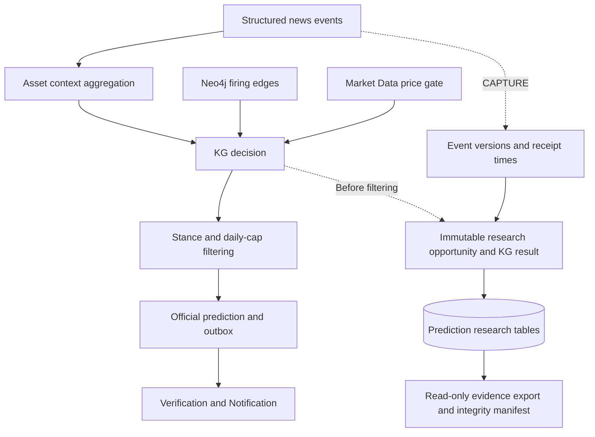

# Prediction service

Prediction aggregates structured news events into asset contexts and produces official KG forecasts.
It also supports optional research evidence capture before forecasts are filtered for publication.
The service behavior, configuration and verification requirements live in
[SRS-04](../../../requirements/SRS-04-prediction.md).

The E15 evidence-capture delivery is implemented and tested locally (PRD-64–PRD-69).
Its functional details and limitations are in
[SRS-04 §7.12](../../../requirements/SRS-04-prediction.md#712-research-evidence-capture),
with [proving tests in §11](../../../requirements/SRS-04-prediction.md#11-verification).
This delivery does not include a trained model, automated training, model comparison or replacement.

## Architecture

This diagram describes the implemented service. The research branch runs only in `CAPTURE` mode;
official forecasts continue through the existing graph-only path.

## Files

| File | Responsibility |
|---|---|
| [prediction/app.py](prediction/app.py) | Service startup, scheduling and health endpoints |
| [prediction/pipeline.py](prediction/pipeline.py) | Event aggregation, decisions, publication filtering and capture hooks |
| [prediction/decision.py](prediction/decision.py) | Graph force summation |
| [prediction/research.py](prediction/research.py) | Immutable event/opportunity evidence and isolated capture failures |
| [prediction/research_export.py](prediction/research_export.py) | Reproducible evidence export command |
| [prediction/db.py](prediction/db.py) | Idempotent service-owned schema |
| [tests/](tests/) | Unit and opt-in integration checks |

For capture settings, export commands and evidence limitations, see
[research evidence capture](../../../requirements/SRS-04-prediction.md#712-research-evidence-capture).
Test commands and code conventions are in [src/README.md](../../README.md).
Remaining training and model-comparison work is tracked in
[E15](../../../backlog/E15-KG-Model-Comparison/README.md).
